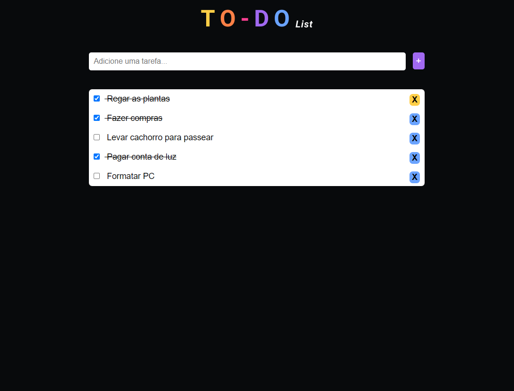

# ToDo-List
#### Desenvolvido para o projeto DevInHouse, a aplicação permite que o usuário cadastre tarefas, marque como concluídas ou as exclua. As tarefas ficam salvas no LocalStorage, protanto é possivel fechar a janela no navegador e abri-la novamente sem perder nada, nem a tarefa e nem seu estado.
 

#### Preview do projeto:

### Tecnologias utilizadas:
- HTML
- css
- JavaScript
